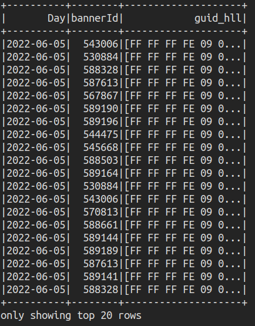

# 1. [Đề bài](TaskKafka.txt):
1. Kafka
   Cụm kafka : 10.3.68.20:9092, 10.3.68.21:9092, 10.3.68.23:9092, 10.3.68.26:9092, 10.3.68.28:9092, 10.3.68.32:9092, 10.3.68.47:9092, 10.3.68.48:9092, 10.3.68.50:9092, 10.3.68.52:9092

Topic : rt-queue_1

Schema: các e cần quan tâm 3 trường {time(0), guid(6), bannerId(4)}. Các trường trong từng mesage sẽ tách nhau bởi "\t".

*   Với time: thời gian tạo record mà user tiếp cận được bannerId.
*   Với guid: id  định danh người dùng. mỗi người có một guid duy nhất.
*   bannerId: cái id banner đã hiện khi e vào website.
2. Bài toán
   Bài toán đếm số lượng user theo từng banner trong một Khoảng thời gian cụ thể.

Ví dụ : a muốn tìm số người đã xem banner 1212xx trong 2 ngày 19,20.
Ket qua : 1212xx trong 2 ngày 19,20 sẽ có khoảng 1triệu user.

Chú ý:
* Thời gian được tính một ngày là thời gian từ 6 giờ hôm nay đến 6 giờ hôm sau. ví dụ: thời gian user vào ngày 19 là khoảng thời gian bắt đầu từ 6 giờ sáng nghày 19- 6h sáng ngày 20
* Sừ dụng thuật toán hyperloglog để ước lượng user. (lấy thư viện java viết sẵn rồi mà quất)

# 2. Ghi dữ liệu
Chạy file bash:

```
./readwrite.sh
```

- Dữ liệu sẽ được đọc từ Kafka mỗi 1 tiếng
- Lọc dữ liệu từ trường value trong mỗi message
- Ép kiểu dữ liệu thành String và tách các trường bằng kí tự phân tách "\t"
- Dữ liệu ghi vào HDFS sẽ được phân chia theo từng ngày
    
- Dữ liệu ghi vào Mysql sẽ được ghi tập trung vào 1 bảng duy nhất - table logs
  

  

# 3. Đếm số lượng user
Xem kết quả:

```
  spark-submit --class app.CountDistinct --master yarn --deploy-mode client --num-executors 2 --executor-memory 2g --executor-cores 2 --packages org.apache.spark:spark-sql-kafka-0-10_2.12:3.2.1 target/task-kafka-1.0-SNAPSHOT-jar-with-dependencies.jar startTime endTime
```
Note: startTime và endTime là khoảng thời gian tùy chọn, điền theo format "yyyy-MM-dd"

- Chương trình sử dụng thuật toán HyperLogLog để đạt được hiệu suất cao hơn và ít tài nguyên hơn
- Sai số của thuật toán nằm trong khoảng 2-3%
- Kết quả không sử dụng HyperLogLog từ HDFS: 


- Kết quả sử dụng HyperLogLog từ HDFS: 


- Kết quả sử dụng HyperLogLog từ Mysql: 


Note: Trước khi chạy lệnh các lệnh bash ở trên, chúng ta phải build thành file jar with dependencies
```
./build.sh
```